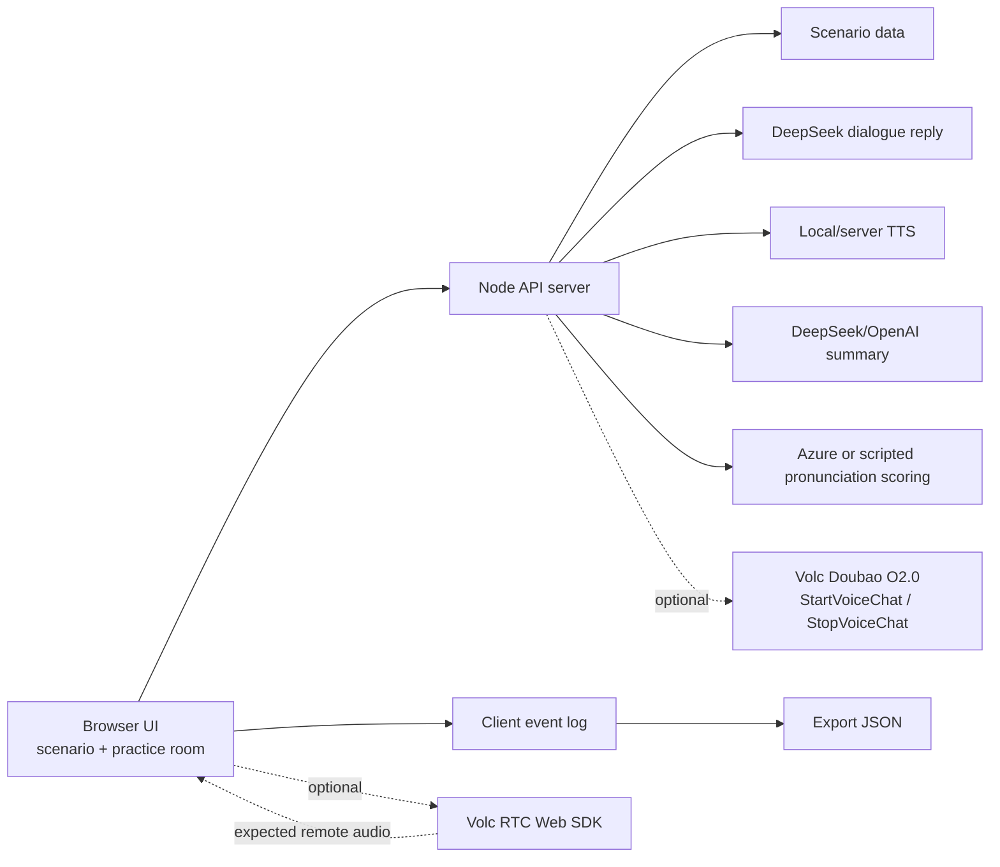

# AI English Speaking Coach

AI English Speaking Coach is an AI-powered English speaking practice project. The initial product direction is a low-latency voice conversation coach for real-world scenarios such as interviews, travel, meetings, ordering food, and social conversation.

## Demo Video

- Video URL: `TODO: paste the final online video link here`
- Recording script: [Demo video script](docs/demo-video-script.md)

## Current Status

The submitted demo is a dependency-free Node.js web app. It includes scenario selection, a practice room, AI role-play replies, voice playback, post-session correction/summary, scripted pronunciation scoring, and diagnostic event logs.

Sprint status: the project is in final demo polish. The original realtime voice architecture was designed around WebRTC + an end-to-end realtime speech provider. We integrated the Doubao O2.0 RTC path up to server-side `StartVoiceChat`/`StopVoiceChat`, RTC client token generation, browser room join, and microphone publishing. During local QA, the browser did not receive a remote RTC audio publish event from the Doubao agent, so the demo defaults to a stable fallback path:

```text
Learner answer
  -> DeepSeek dialogue reply
  -> local/server TTS voice playback
  -> conversation transcript
  -> DeepSeek post-session summary
  -> scripted pronunciation scoring
```

This keeps the full learning-product loop demonstrable while preserving the Doubao RTC implementation and diagnostics for follow-up provider debugging. See [Demo runbook and status](docs/demo-runbook-and-status.md) for current phase and remaining work.

## What This Demo Shows

- Scenario-based speaking practice: interview, restaurant ordering, and business meeting.
- AI role-play conversation: the coach asks short contextual follow-up questions.
- Voice output: the AI reply is converted to playable audio through local/server TTS.
- Fallback-aware interaction: if browser speech recognition or RTC audio fails, the user can continue with typed English answers.
- Post-session learning report: overall score, sub-scores, grammar/expression corrections, and practice tasks.
- Scripted pronunciation practice: record/read a recommended sentence and receive structured pronunciation feedback.
- Diagnostics: every provider event is recorded in the UI and can be exported as JSON.

## Architecture



The design intentionally separates two concerns:

- **Realtime interaction path**: optimized for natural conversation and low latency.
- **Learning analysis path**: optimized for stable transcript, accurate correction, post-session summary, and measurable feedback.

That separation is important because live conversation should not be interrupted by long grammar analysis, while scoring and correction need more stable text/audio evidence.

## Run Locally

```bash
node server.mjs
```

Then open:

```text
http://localhost:3000
```

The default demo provider is **Stable Realtime Voice**. It uses DeepSeek for short role-play replies and local/server TTS for AI voice playback. If the browser does not allow automatic speech recognition, type an English answer in the input box and click **Send**; the AI reply still comes from the same dialogue endpoint.

During a practice session, use **Export JSON** to download the current scenario, turns, summary, pronunciation text, pronunciation result, and event log.

Useful checks:

```bash
node --check server.mjs public/app.js lib/openai-summary.mjs
node --test tests/*.test.mjs
```

## Parallel Next.js Shell

This branch also includes a Next.js + TypeScript shell under `apps/web-next`. It is a parallel migration path and does not replace the current Node demo.

```bash
npm install --prefix apps/web-next
npm run next:dev
```

Then open:

```text
http://localhost:3001
```

Useful checks:

```bash
npm run next:shell:smoke
npm run next:typecheck
npm run next:build
```

## Provider Configuration

To try the OpenAI Realtime path, copy `.env.example` to `.env` or export the variables in your shell:

```bash
export OPENAI_API_KEY="your_api_key"
export REALTIME_PROVIDER="openai"
export OPENAI_REALTIME_MODEL="gpt-realtime-2"
export OPENAI_TEXT_MODEL="gpt-4.1-mini"
node server.mjs
```

To prepare the Doubao O2.0 realtime path, use:

```bash
export REALTIME_PROVIDER="volc_doubao"
export VOLC_DOUBAO_MODEL="1.2.1.1"
export VOLC_RTC_APP_ID="your_volc_rtc_app_id"
export VOLC_RTC_APP_KEY="your_volc_rtc_app_key"
export VOLC_RTC_TOKEN_TTL_SECONDS="86400"
export VOLC_RTC_WEB_SDK_URL="https://lf-unpkg.volccdn.com/obj/vcloudfe/sdk/@volcengine/rtc/4.68.4/1778142355039/index.min.js"
export VOLC_RTC_OPENAPI_HOST="rtc.volcengineapi.com"
export VOLC_RTC_OPENAPI_REGION="cn-north-1"
export VOLC_RTC_OPENAPI_VERSION="2024-12-01"
export VOLCENGINE_ACCESS_KEY_ID="your_volcengine_ak"
export VOLCENGINE_SECRET_ACCESS_KEY="your_volcengine_sk"
export VOLC_DOUBAO_S2S_APP_ID="your_s2s_app_id"
export VOLC_DOUBAO_S2S_TOKEN="your_s2s_token"
node server.mjs
```

`1.2.1.1` is the Doubao O2.0 end-to-end realtime speech model. The backend builds the `StartVoiceChat` configuration, signs the Volc RTC OpenAPI request with server-side AK/SK, calls `StartVoiceChat`, and redacts the S2S token from browser responses. When `VOLC_RTC_APP_KEY` is configured, the backend generates a room-scoped RTC client token for the session; `VOLC_RTC_CLIENT_TOKEN` remains available only as a temporary manual override.

The browser loads the official `@volcengine/rtc` Web SDK CDN by default, joins the same room with auto-publish audio and auto-subscribe audio, listens for subtitle/message callbacks, and calls the backend `StopVoiceChat` endpoint when the practice ends.

Current Doubao QA result:

- Server-side `StartVoiceChat` succeeds.
- Browser RTC room join succeeds.
- Browser microphone publish succeeds.
- The browser did not receive a remote agent audio publish event during local QA, so no remote audio stream was available to subscribe/play.
- The default demo therefore uses the DeepSeek + local TTS fallback while keeping Doubao diagnostics in the event log.

The post-session summary uses DeepSeek when `DEEPSEEK_API_KEY` is configured, then OpenAI if configured. Set `USE_MOCK_ANALYSIS=true` to force mock reports during demos.
`POST /api/sessions/:id/transcribe` accepts `audioBase64` + `mimeType` and uses `OPENAI_TRANSCRIBE_MODEL` when an OpenAI key is configured; otherwise it falls back to rough transcript/mock text.
The scripted pronunciation recorder sends captured browser audio to the backend. If `AZURE_SPEECH_KEY` plus `AZURE_SPEECH_ENDPOINT` or `AZURE_SPEECH_REGION` are configured, the backend attempts Azure Pronunciation Assessment for WAV/OGG audio; browser WebM recordings still fall back to mock feedback unless converted.

In another terminal, run the API smoke test:

```bash
node scripts/smoke-test.mjs
```

## Main API Routes

- `GET /api/scenarios`: scenario list.
- `POST /api/realtime/session`: create OpenAI/Doubao/mock realtime setup.
- `POST /api/realtime/session/:id/start`: start Doubao agent after RTC join.
- `POST /api/realtime/session/:id/stop`: stop Doubao voice chat.
- `POST /api/dialogue/reply`: short DeepSeek role-play reply for the stable demo path.
- `POST /api/tts`: local/server TTS audio for AI voice playback.
- `POST /api/sessions/:id/transcribe`: audio transcription endpoint.
- `POST /api/sessions/:id/summary`: post-session correction and learning report.
- `POST /api/pronunciation/scripted`: scripted pronunciation assessment.
- `GET /api/health`: provider/configuration diagnostics.
- `GET/POST/DELETE /api/client-events`: browser event diagnostics.

## Docs

- [Design draft](docs/ai-english-speaking-coach-design.md)
- [Team alignment voice MVP](docs/team-alignment-voice-mvp.md)
- [GStack dual-track phase plan](docs/gstack-dual-track-phase-plan.md)
- [Route B AI handoff](docs/route-b-ai-handoff.md)
- [Demo runbook and status](docs/demo-runbook-and-status.md)
- [Demo video script](docs/demo-video-script.md)
- [Volc Doubao realtime plan](docs/volc-doubao-realtime-plan.md)

## Collaboration

- Use pull requests for changes to `main`.
- Keep product decisions and architecture notes in `docs/`.
- Prefer small, reviewable commits.
