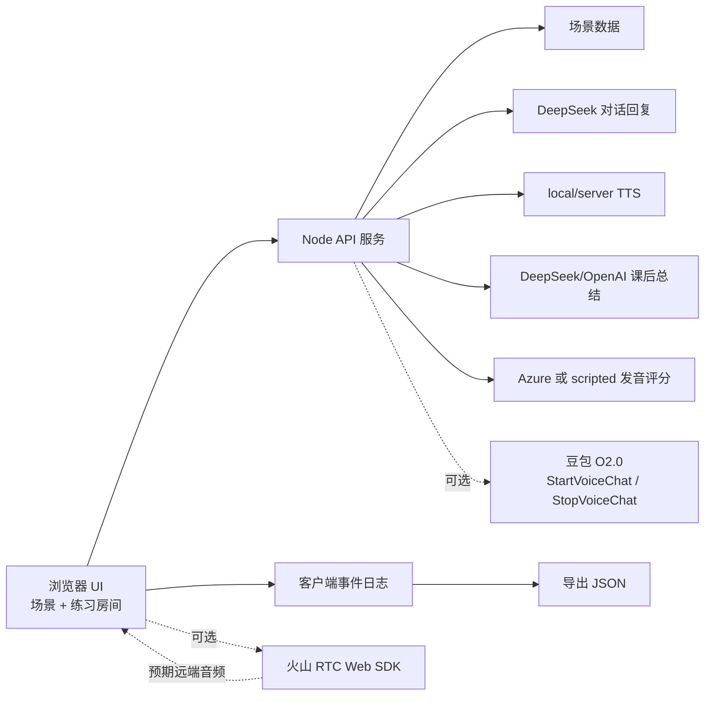

# AI 英语口语教练

AI 英语口语教练是一款面向真实场景的英语口语练习工具。项目目标是让用户在面试、点餐、会议等场景中进行接近真人的英文对话训练，并在课后获得可解释、可量化的学习反馈。

## 演示视频

- 视频地址：[20260607182246.mp4](https://github.com/AAA-413/ai-english-speaking-coach/releases/download/demo-video-20260607/20260607182246.mp4)
- Release 页面：[demo-video-20260607](https://github.com/AAA-413/ai-english-speaking-coach/releases/tag/demo-video-20260607)
- 录制脚本：[Demo video script](docs/demo-video-script.md)

## 当前状态

提交版本是一个无前端依赖的 Node.js Web 应用，已经具备完整演示闭环：场景选择、练习房间、AI 角色扮演回复、语音播放、课后纠错总结、scripted 跟读发音评测，以及可导出的诊断事件日志。

原本设计的实时语音主线是 **WebRTC + 端到端实时语音模型**。项目已经接入豆包 O2.0 RTC 路线，包括服务端 `StartVoiceChat` / `StopVoiceChat`、RTC client token 生成、浏览器加入房间、麦克风发布等能力。本地 QA 时发现：`StartVoiceChat` 成功，浏览器也成功进房并发布麦克风，但浏览器没有收到豆包 agent 的远端音频发布事件，因此无法订阅和播放远端音频流。

为了保证最终提交视频稳定展示完整产品能力，当前默认演示链路改为稳定兜底：

```text
用户英文回答
  -> DeepSeek 生成场景化英文追问
  -> local/server TTS 播放 AI 语音
  -> 对话记录
  -> DeepSeek 课后总结
  -> scripted 跟读发音评测
```

这个方案保留了豆包 RTC 实现和诊断日志，同时保证评委能看到完整的口语训练产品闭环。当前阶段和剩余事项见 [演示 Runbook 与当前进度](docs/demo-runbook-and-status.md)。

## 这个 Demo 展示了什么

- 场景化口语练习：面试、点餐、会议。
- AI 角色扮演对话：AI 会根据当前场景进行简短追问。
- AI 语音输出：AI 回复会通过 local/server TTS 转成可播放音频。
- 可降级交互：浏览器语音识别或 RTC 音频失败时，用户仍可通过输入框继续英文对话。
- 课后学习报告：总分、分项分、语法/表达纠错、下一步练习任务。
- 跟读发音评测：基于推荐句子的录音/识别结果，给出结构化发音反馈。
- 诊断和导出：关键 provider 事件会展示在页面中，并可导出 JSON。

## 架构设计



系统刻意拆成两条链路：

- **实时互动链路**：优先保证自然对话、低延迟和少打断。
- **学习反馈链路**：优先保证稳定转写、准确纠错、课后总结和可量化反馈。

这样设计的原因是：实时练习时频繁打断会影响用户开口，而纠错和评分需要更稳定的文本/音频证据。

## 本地运行

```bash
node server.mjs
```

然后打开：

```text
http://localhost:3000
```

默认演示模式是 **稳定实时语音**。它使用 DeepSeek 生成简短角色扮演回复，并用 local/server TTS 播放 AI 语音。如果当前浏览器不允许自动语音识别，可以在输入框中输入英文回答并点击发送；AI 回复仍然来自同一个对话接口。

练习过程中可以点击 **导出 JSON**，下载当前场景、对话 turns、课后总结、推荐发音句子、发音结果和事件日志。

常用检查命令：

```bash
node --check server.mjs public/app.js lib/openai-summary.mjs
node --test tests/*.test.mjs
```

## 并行 Next.js Shell

项目中还保留了 `apps/web-next` 下的 Next.js + TypeScript 并行版本。它是后续迁移路径，不替代当前稳定的 Node demo。

```bash
npm install --prefix apps/web-next
npm run next:dev
```

然后打开：

```text
http://localhost:3001
```

相关检查：

```bash
npm run next:shell:smoke
npm run next:typecheck
npm run next:build
```

## Provider 配置

如需尝试 OpenAI Realtime 路线，可以复制 `.env.example` 为 `.env`，或在 shell 中导出：

```bash
export OPENAI_API_KEY="your_api_key"
export REALTIME_PROVIDER="openai"
export OPENAI_REALTIME_MODEL="gpt-realtime-2"
export OPENAI_TEXT_MODEL="gpt-4.1-mini"
node server.mjs
```

如需准备豆包 O2.0 实时语音路线：

```bash
export REALTIME_PROVIDER="volc_doubao"
export VOLC_DOUBAO_MODEL="1.2.1.1"
export VOLC_RTC_APP_ID="your_volc_rtc_app_id"
export VOLC_RTC_APP_KEY="your_volc_rtc_app_key"
export VOLC_RTC_TOKEN_TTL_SECONDS="86400"
export VOLC_RTC_WEB_SDK_URL="https://lf-unpkg.volccdn.com/obj/vcloudfe/sdk/@volcengine/rtc/4.68.4/1778142355039/index.min.js"
export VOLC_RTC_OPENAPI_HOST="rtc.volcengineapi.com"
export VOLC_RTC_OPENAPI_REGION="cn-north-1"
export VOLC_RTC_OPENAPI_VERSION="2024-12-01"
export VOLCENGINE_ACCESS_KEY_ID="your_volcengine_ak"
export VOLCENGINE_SECRET_ACCESS_KEY="your_volcengine_sk"
export VOLC_DOUBAO_S2S_APP_ID="your_s2s_app_id"
export VOLC_DOUBAO_S2S_TOKEN="your_s2s_token"
node server.mjs
```

`1.2.1.1` 是豆包 O2.0 端到端实时语音模型。后端会构造 `StartVoiceChat` 配置，用服务端 AK/SK 签名火山 RTC OpenAPI 请求，调用 `StartVoiceChat`，并在浏览器响应中隐藏 S2S token。配置 `VOLC_RTC_APP_KEY` 后，后端可以为每个 session 生成房间级 RTC client token；`VOLC_RTC_CLIENT_TOKEN` 仍可作为临时手动覆盖项。

浏览器默认加载官方 `@volcengine/rtc` Web SDK CDN，加入同一个 RTC 房间，自动发布麦克风并自动订阅音频，监听字幕/消息回调，并在练习结束时调用后端 `StopVoiceChat`。

当前豆包 QA 结果：

- 服务端 `StartVoiceChat` 成功。
- 浏览器 RTC 加房成功。
- 浏览器麦克风发布成功。
- 本地 QA 中，浏览器未收到远端 agent 音频发布事件，因此没有远端音频流可订阅/播放。
- 当前默认演示使用 DeepSeek + local TTS 兜底，同时保留豆包诊断日志。

课后总结在配置 `DEEPSEEK_API_KEY` 时优先使用 DeepSeek，其次可使用 OpenAI。可以设置 `USE_MOCK_ANALYSIS=true` 强制使用 mock 报告。
`POST /api/sessions/:id/transcribe` 接受 `audioBase64` 和 `mimeType`，配置 OpenAI key 时使用 `OPENAI_TRANSCRIBE_MODEL`，否则回退到 rough transcript/mock 文本。
scripted 发音评测会把浏览器录音发送到后端。如果配置了 `AZURE_SPEECH_KEY` 和 `AZURE_SPEECH_ENDPOINT` 或 `AZURE_SPEECH_REGION`，后端会尝试 Azure Pronunciation Assessment；否则使用 scripted fallback，保证演示不断。

另开一个终端可以运行 API smoke test：

```bash
node scripts/smoke-test.mjs
```

## 主要 API 路由

- `GET /api/scenarios`：获取场景列表。
- `POST /api/realtime/session`：创建 OpenAI / 豆包 / mock 实时会话配置。
- `POST /api/realtime/session/:id/start`：浏览器加入 RTC 后启动豆包 agent。
- `POST /api/realtime/session/:id/stop`：停止豆包 voice chat。
- `POST /api/dialogue/reply`：稳定演示链路中的 DeepSeek 场景化追问。
- `POST /api/tts`：local/server TTS，生成 AI 语音播放音频。
- `POST /api/sessions/:id/transcribe`：音频转写接口。
- `POST /api/sessions/:id/summary`：课后纠错和学习报告。
- `POST /api/pronunciation/scripted`：scripted 跟读发音评测。
- `GET /api/health`：provider 和配置诊断。
- `GET/POST/DELETE /api/client-events`：浏览器事件诊断。

## 文档

- [调研设计稿](docs/ai-english-speaking-coach-design.md)
- [团队语音 MVP 对齐文档](docs/team-alignment-voice-mvp.md)
- [GStack 双路线阶段计划](docs/gstack-dual-track-phase-plan.md)
- [路线 B AI handoff](docs/route-b-ai-handoff.md)
- [演示 Runbook 与当前进度](docs/demo-runbook-and-status.md)
- [演示视频脚本](docs/demo-video-script.md)
- [豆包实时语音接入计划](docs/volc-doubao-realtime-plan.md)

## 协作约定

- 修改 `main` 前使用 Pull Request。
- 产品决策和架构说明放在 `docs/`。
- 优先提交小而清晰、方便 review 的改动。
