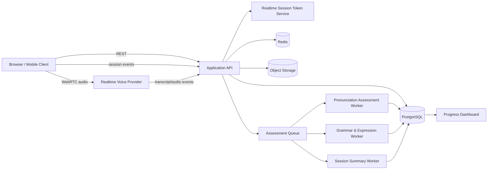
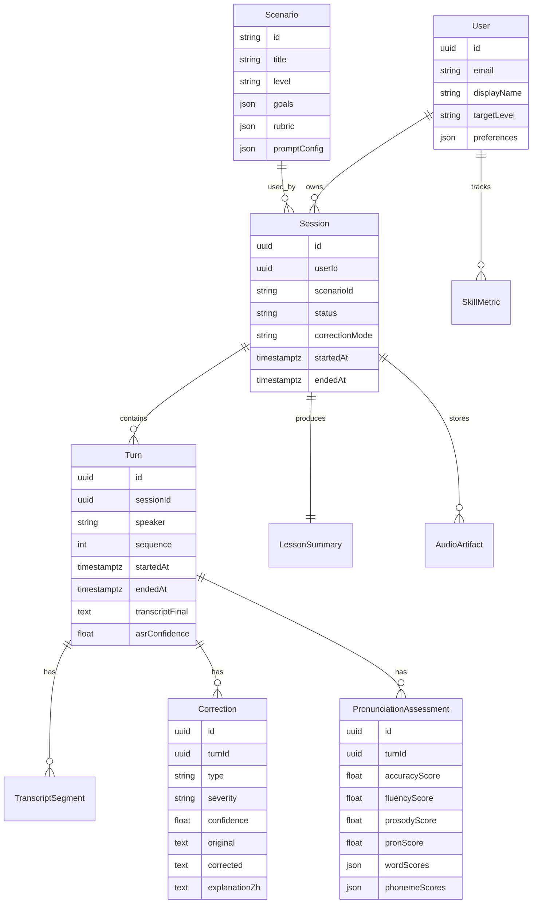

# AI 英语口语陪练设计文档

调研日期：2026-06-05  
阶段：方案设计草案，尚未进入实现

## 1. 背景与目标

本产品是一款面向英语学习者的 AI 口语陪练工具。它需要让用户在面试、点餐、会议、旅行、社交等真实场景中进行自然语音对话，并在练习后获得发音、语法、表达、流利度和场景完成度的可量化反馈。

核心目标：

- 用户可以选择场景、难度、口音偏好和纠错方式。
- 用户可以用语音和 AI 进行低延迟、多轮、可打断的自然对话。
- 系统能在不破坏对话沉浸感的前提下给出纠错。
- 系统能对发音、语法、词汇、流利度、互动能力给出分项评分。
- 系统能形成课后总结、复盘建议和下一步训练任务。
- 架构必须支持供应商替换、场景扩展、评分规则扩展和用户规模扩展。

非目标：

- MVP 不做官方英语考试认证。
- MVP 不做真人教师市场。
- MVP 不做视频数字人；可以预留头像/视频能力。
- MVP 不追求“纠正成某一种母语口音”，优先追求可理解度和场景表达有效性。

## 2. 调研摘要

调研结论一：实时语音陪练不宜用单一路径承载所有能力。OpenAI Realtime API 支持浏览器通过 WebRTC 连接实时模型，官方文档建议浏览器语音到语音应用优先使用 WebRTC 以获得更一致的性能；同时 VAD 支持基于静音或语义的轮次切分。这个路径适合“自然对话”和“低延迟响应”。

调研结论二：发音评测需要专门的评测模型或服务。Azure Pronunciation Assessment 明确提供 accuracy、fluency、completeness、prosody、phoneme/word/full text 粒度，并区分 scripted 与 unscripted assessment。它也说明在需要高精度文本时，可以先做 STT 获得参考文本，再做 scripted assessment。因此，自由对话里的发音反馈要谨慎，最好和“跟读/复述”练习结合。

调研结论三：实时转写本身存在“快 vs 准”的权衡。Deepgram 文档说明 endpointing 可以用 300-500ms 静音更适合会中途停顿的对话；AWS Transcribe 文档说明 partial-result stabilization 可以降低延迟，但可能影响准确率。产品上不能把未稳定转写直接用于严肃纠错。

调研结论四：纠错时机不是越实时越好。第二语言纠错反馈研究把 immediate、interim、delayed feedback 区分为不同教学时机；即时反馈通常有助于在任务中对照错误和正确形式，但研究结论不是绝对，延迟反馈如果插入到用户原始表现上下文中，也可能有效。因此产品应提供用户可选模式：少打断、及时纠错、课后集中纠错。

调研结论五：能力反馈应参考可解释维度，而不是只给一个总分。CEFR Companion Volume 的口语质量维度包含 range、accuracy、fluency、interaction、coherence、phonology。产品可以对齐这些维度形成“CEFR-inspired”评分，但不能在未经校准前宣称等同官方 CEFR 等级。

## 3. 用户体验设计

### 3.1 主要用户

- 面试准备者：需要练习自我介绍、项目经历、行为面试、追问应对。
- 商务英语用户：需要练习会议发言、异议表达、项目同步、谈判表达。
- 日常口语用户：需要练习点餐、问路、酒店入住、闲聊。
- 考试备考用户：需要练习雅思/托福/PTE 类口语任务，但 MVP 只做通用能力训练。

### 3.2 练习流程

1. 选择场景：面试、点餐、会议、旅行、社交、客服、演讲。
2. 选择难度：A1/A2/B1/B2/C1，作为内容和反馈粒度参考。
3. 选择目标：流利度、发音、语法准确、自然表达、临场反应。
4. 选择纠错节奏：
   - 沉浸模式：对话中只在严重误解时打断，课后总结。
   - 教练模式：每 2-3 轮给一个简短纠错。
   - 即时模式：高置信错误立即提示，但限制频率。
5. 麦克风检查：音量、噪声、设备、网络延迟。
6. 实时对话：AI 根据场景扮演面试官、服务员、同事等角色。
7. 课后总结：展示评分、错误类型、原句/改写、发音重点、推荐练习。
8. 复练：把本次高频错误转成跟读、替换表达、迷你对话。

### 3.3 场景结构

每个场景不只是一段提示词，而是一个可配置脚本：

```json
{
  "id": "job_interview_product_manager_b1",
  "title": "产品经理面试",
  "level": "B1",
  "roles": {
    "user": "candidate",
    "ai": "interviewer"
  },
  "goals": [
    "完成 60 秒自我介绍",
    "解释一个过往项目",
    "回应一次追问",
    "提出一个反问"
  ],
  "targetSkills": ["fluency", "grammar", "interaction", "vocabulary"],
  "keywords": ["cross-functional", "prioritize", "stakeholder"],
  "rubric": {
    "taskCompletion": 30,
    "fluency": 20,
    "grammar": 20,
    "vocabulary": 15,
    "interaction": 15
  },
  "allowedCorrectionTiming": ["after_turn", "post_session"]
}
```

这种结构能让内容团队扩展场景，而不是每次改代码。

## 4. 方案对比

### 方案 A：纯端到端实时语音模型

浏览器直接通过 WebRTC 接入实时语音模型，由模型完成听、想、说、部分纠错。

优点：

- 端到端链路短，体验最自然。
- 可打断、轮次感、情绪和语气表现更好。
- 工程复杂度最低，适合快速验证。

缺点：

- 对发音细粒度评分、稳定转写、纠错证据链的控制不足。
- 供应商行为变化会影响产品稳定性。
- 深度评测如果也依赖实时模型，结果一致性较难保证。

### 方案 B：传统流水线 STT -> LLM -> TTS

音频先转写，再交给文本模型生成回复，最后 TTS 播放。

优点：

- 每个环节可替换，日志和评分更清楚。
- 语法纠错、结构化输出、质检更容易控制。
- 适合企业合规和私有化扩展。

缺点：

- 延迟更高，尤其是 STT 终止判断和 TTS 首包。
- 打断和自然轮次处理更复杂。
- 用户会感觉“机器在等一句完整话”，沉浸感较弱。

### 方案 C：混合双链路，推荐

实时对话走端到端语音模型；评测、纠错、总结走并行/异步链路。实时链路只负责自然互动和少量高置信提示；评测链路基于音频片段、稳定转写和专门评分服务产出可靠反馈。

优点：

- 兼顾自然度和评测准确度。
- 失败隔离好：评测服务慢了不影响继续聊天。
- 易扩展：发音、语法、场景评分都可以作为插件替换。
- 易控成本：高成本深度评测可以放到课后或付费档。

缺点：

- 工程复杂度高于纯实时方案。
- 需要设计事件同步、音频切片、结果回填和幂等处理。

推荐选择方案 C。原因是你的需求同时强调自然对话、低延迟、纠错精准和可量化反馈，这些目标无法靠单一实时链路稳定满足。

## 5. 推荐架构



### 5.1 客户端

职责：

- 场景选择、难度选择、纠错节奏选择。
- 麦克风授权、设备选择、音量/噪声检测。
- WebRTC 连接建立、重连、断线降级。
- 实时字幕展示，但标记 partial/final 状态。
- 对话状态展示：AI 思考中、用户发言中、网络异常、总结生成中。
- 课后总结和复练任务展示。

建议技术：

- Web MVP：Next.js 或 React + Vite。
- 音频：WebRTC、MediaStream、AudioWorklet。
- 状态：轻量 store，例如 Zustand。
- 后续移动端：React Native 或 Flutter，复用 API 和场景 DSL。

### 5.2 后端 API

职责：

- 用户、场景、会话、总结、进度数据。
- 颁发实时会话 token，不暴露供应商主 API key。
- 接收客户端事件和实时模型事件。
- 创建音频切片与转写片段。
- 投递评测任务。
- 统一供应商适配器。

建议技术：

- Node.js + NestJS/Fastify，或 Python FastAPI。
- PostgreSQL 存业务和评测结果。
- Redis 存短期会话状态、限流、任务锁。
- BullMQ/Temporal 处理课后评测队列。
- Object Storage 保存音频片段，默认短期保留。

### 5.3 实时语音链路

目标：

- 用户说话后，AI 首段音频响应目标 p95 小于 1.5 秒。
- 支持用户打断 AI。
- 支持静音检测和语义轮次判断。
- 支持网络异常时重连或降级到“按住说话/录音提交”。

推荐策略：

- 浏览器通过后端拿临时会话信息。
- 浏览器用 WebRTC 接入实时语音模型。
- VAD 默认使用较保守配置，避免用户思考时被打断。
- 面试/会议类场景优先 semantic VAD 或较长 silence threshold。
- 点餐/短问答场景可以更激进，缩短轮次等待。
- 所有实时事件写入会话事件流，用于审计、重放和调试。

### 5.4 并行评测链路

评测链路不阻塞对话。它处理三个层次：

- Turn-level：每个用户发言结束后做轻量语法/表达检测。
- Segment-level：对关键句子做发音/流利度评测。
- Session-level：结束后做综合总结、趋势更新和复练推荐。

音频片段切分原则：

- 每个用户 turn 记录开始/结束时间。
- 长发言按 8-15 秒切片，保留上下文索引。
- 保存音频采样率、设备、噪声估计、ASR 置信度。
- 所有评测结果回写到 turn_id 和 segment_id，避免错配。

## 6. AI 模块设计

### 6.1 Tutor Agent

职责：

- 按场景角色自然推进对话。
- 根据用户水平调整句子长度和词汇难度。
- 避免一轮讲太多。
- 不在沉浸模式频繁纠错。
- 在用户卡住时给轻提示，例如换一种问法或提供选择。

核心提示策略：

- 系统角色绑定场景、难度、目标、纠错节奏。
- 每个场景提供必达目标和可选追问。
- 模型输出应优先语音自然，不输出长篇解释。
- 工具调用只用于更新目标完成状态或请求后端评分，不直接处理敏感逻辑。

### 6.2 Correction Agent

职责：

- 检测语法、词汇、表达自然度、语用问题。
- 输出结构化纠错，不直接改写所有句子。
- 只选择最有学习价值的 1-3 个问题。
- 根据时机策略决定是否即时提示。

结构化输出：

```json
{
  "turnId": "turn_123",
  "items": [
    {
      "type": "grammar",
      "severity": "medium",
      "confidence": 0.86,
      "original": "I have been work in this company for three years.",
      "corrected": "I have been working at this company for three years.",
      "explanationZh": "现在完成进行时需要 have been + doing；公司通常用 at。",
      "betterExpression": "I've spent the last three years working at this company.",
      "timing": "post_turn"
    }
  ]
}
```

纠错门槛：

- 低置信度不纠错，只进入课后候选。
- 不纠正不影响理解的小瑕疵，除非用户目标是语法准确。
- 每个 turn 最多一个即时提示。
- 对面试、会议类场景优先纠正影响专业表达的问题。

### 6.3 Pronunciation Evaluator

职责：

- 给出音素、单词、句子、韵律、流利度反馈。
- 区分自由对话评分和跟读评分。
- 只对有足够音频质量和 ASR 置信度的片段评分。

评测模式：

- Scripted mode：用户跟读系统给出的句子，有 reference text，适合发音训练。
- Unscripted mode：用户自由表达，无固定 reference，适合流利度和整体可理解度。
- Hybrid mode：对自由表达先稳定转写，再选取关键句让用户复述，二次评分。

推荐做法：

- MVP 中自由对话只展示总体 pronunciation / fluency 趋势，不展示过度精细的音素结论。
- 发音专项练习使用 scripted assessment，展示单词和音素反馈。
- 对中文用户常见问题建立专项规则，例如 /θ/、/ð/、/v/、/w/、词重音、句子重音。

### 6.4 Summary Agent

职责：

- 汇总本次会话表现。
- 生成用户可执行的改进建议。
- 更新长期能力画像。
- 生成下次练习计划。

总结内容：

- 场景目标完成度。
- 今日表现：发音、流利度、语法、词汇、互动。
- 3 个最值得修正的问题。
- 3 个更自然表达。
- 1 个发音重点。
- 2-3 个复练任务。
- 趋势变化：相对近 7/30 天是否进步。

## 7. 量化指标设计

### 7.1 单次会话指标

- speaking_time_seconds：用户实际说话时长。
- turn_count：用户发言轮数。
- avg_turn_duration_seconds：平均发言时长。
- words_per_minute：语速。
- pause_ratio：停顿占比。
- filler_count_per_minute：um/uh/you know 等填充词频率。
- asr_confidence_avg：转写平均置信度。
- grammar_error_rate：每 100 词语法问题数。
- vocabulary_variety：词汇多样性，使用 type-token ratio 或更稳健的 MTLD。
- scenario_goal_completion：场景目标完成度。
- pronunciation_score：发音总体分。
- fluency_score：流利度分。
- interaction_score：是否能接话、追问、澄清、结束话题。

### 7.2 长期能力画像

使用 skill vector：

```json
{
  "pronunciation": 72,
  "fluency": 66,
  "grammar": 78,
  "vocabulary": 63,
  "interaction": 70,
  "scenarioTaskCompletion": 75
}
```

每个分数都保存：

- 当前值。
- 置信度。
- 最近 7 天变化。
- 最近 30 天变化。
- 样本数量。
- 最近高频错误。

### 7.3 CEFR 对齐

产品可以提供 CEFR-inspired 能力描述：

- A2：能完成短句问答，但停顿和修正明显。
- B1：能维持熟悉话题对话，发音整体可理解。
- B2：能较流畅表达观点，语法错误较少影响理解。

注意：除非建立标注集、人类评分校准和统计验证，否则不要把它称为正式 CEFR 评级。

## 8. 数据模型草案



## 9. API 草案

### 9.1 会话

- `POST /api/sessions`
  - 创建练习会话。
  - 入参：scenarioId、level、correctionMode、voice、accentPreference。
  - 返回：sessionId、status。

- `POST /api/sessions/:id/realtime-token`
  - 颁发实时语音连接所需的临时信息。
  - 不向客户端暴露主 API key。

- `POST /api/sessions/:id/events`
  - 接收客户端事件，例如连接状态、用户开始说话、用户停止说话、字幕更新。
  - 事件必须有 eventId，后端幂等处理。

- `POST /api/sessions/:id/end`
  - 结束会话，触发总结任务。

### 9.2 评测

- `GET /api/sessions/:id/summary`
  - 获取课后总结。
  - 若仍在生成，返回 status 为 processing。

- `GET /api/sessions/:id/corrections`
  - 获取本次纠错列表。

- `POST /api/pronunciation/scripted`
  - 跟读专项评测。
  - 入参：referenceText、audioArtifactId。

### 9.3 场景

- `GET /api/scenarios`
  - 获取可用场景列表。

- `GET /api/scenarios/:id`
  - 获取场景详情、目标、推荐词汇和评分规则。

## 10. 稳定性设计

### 10.1 实时链路降级

降级层级：

1. 正常 WebRTC 实时语音对话。
2. WebRTC 重连，保留会话上下文。
3. 降级到按住说话，用户录音后提交。
4. 降级到文字对话，课后评测暂停。

前端必须明确展示当前状态，避免用户误以为 AI 没听见。

### 10.2 幂等和事件溯源

- 所有会话事件都带 eventId。
- 后端重复收到事件时只处理一次。
- turn、segment、assessment 都有稳定 ID。
- 评测任务可重试，但不得生成重复总结。
- 保存 provider raw event 摘要，用于排查延迟和错配问题。

### 10.3 供应商容错

- RealtimeProvider、SttProvider、PronunciationProvider、TextModelProvider 都定义接口。
- 每个 provider 有独立超时、重试、熔断、限流。
- 课后评测可重试；实时对话不做长重试，快速降级。
- 供应商错误记录到统一 observability 字段。

### 10.4 监控指标

实时体验：

- WebRTC connection success rate。
- time_to_first_ai_audio p50/p95/p99。
- user_turn_to_ai_audio_latency。
- interruption_success_rate。
- reconnect_count_per_session。
- realtime_error_rate。

评测质量：

- assessment_queue_lag。
- summary_generation_latency。
- correction_accept_rate。
- correction_report_rate。
- pronunciation_score_distribution。
- asr_confidence_distribution。

业务效果：

- session_completion_rate。
- repeat_session_rate。
- weekly_active_learners。
- average_speaking_minutes_per_user。
- skill_score_delta_7d/30d。

## 11. 扩展性设计

### 11.1 内容扩展

场景使用配置化 DSL。后续可以增加：

- 行业面试：互联网、金融、外贸、客服。
- 会议角色：主持人、汇报人、挑战者、记录者。
- 难度变体：同一场景按 A2/B1/B2 输出不同提示。
- 文化语境：美式直接表达、英式礼貌表达、跨国会议表达。

### 11.2 能力评测扩展

评测模块插件化：

- PronunciationEvaluator
- GrammarEvaluator
- VocabularyEvaluator
- FluencyEvaluator
- InteractionEvaluator
- ScenarioGoalEvaluator

每个 evaluator 输出统一格式：

```json
{
  "metric": "fluency",
  "score": 66,
  "confidence": 0.82,
  "evidence": [
    {
      "turnId": "turn_123",
      "text": "I think... um... maybe we can...",
      "reason": "long hesitation and filler words"
    }
  ],
  "recommendations": ["练习用 3 句结构回答观点题"]
}
```

### 11.3 多端扩展

- Web MVP 先验证体验和模型链路。
- 移动端复用场景、会话、总结 API。
- 原生移动端可优化音频采集、回声消除、蓝牙耳机兼容。

### 11.4 企业和课堂扩展

预留：

- 教师/管理员查看班级进度。
- 作业分配和批量场景。
- 组织级数据保留策略。
- 人工抽检评分。
- LMS 集成。

## 12. 安全与隐私

原则：

- API key 只在后端保存。
- 实时会话使用短期 token 或服务端中转。
- 音频保存默认短期保留，并允许用户关闭。
- 用户可删除历史音频、转写和总结。
- 音频和转写分开存储，敏感字段加密。
- 对未成年人场景增加保护策略。
- 明确告知用户 AI 可能出错，支持反馈/举报。

数据保留建议：

- 免费用户：音频默认 7 天，转写和总结可长期保存。
- 付费用户：音频可选 30/90 天，用于复盘。
- 企业用户：按组织策略配置。

## 13. 测试策略

### 13.1 单元测试

- 场景 DSL 解析。
- 纠错结构化输出校验。
- 指标计算。
- provider adapter 错误映射。
- 幂等事件处理。

### 13.2 集成测试

- 模拟 realtime provider 事件流。
- 模拟 STT partial/final 转写。
- 模拟 pronunciation provider 返回。
- 会话结束后 summary worker 正确生成结果。

### 13.3 音频回归测试

建立小型 golden audio set：

- 不同口音：中国用户、印度口音、非母语欧洲口音。
- 不同噪声：安静、轻微背景声、耳机麦、电脑麦。
- 不同任务：短句、长句、自由回答、跟读。

每次模型或 provider 变更后对比：

- 转写稳定性。
- 发音评分波动。
- 纠错命中率。
- 错误提示是否过度。

### 13.4 人工质检

上线初期每周抽检：

- 纠错是否准确。
- 发音反馈是否可执行。
- 总结是否鼓励但不空泛。
- 场景角色是否自然。
- 是否出现不合适内容。

## 14. 分阶段路线图

### Phase 0：技术验证，1-2 周

目标：

- 跑通 WebRTC 实时语音对话。
- 3 个场景：面试、点餐、会议。
- 保存稳定转写。
- 生成基础课后总结。

验收：

- 10 分钟内可连续对话。
- p95 首段 AI 音频小于 1.5 秒或记录实际瓶颈。
- 断线后可重连或降级。
- 总结能引用用户原句。

### Phase 1：MVP，4-6 周

目标：

- 登录、历史记录、场景库。
- 纠错模式选择。
- scripted pronunciation assessment。
- 课后能力分和复练任务。
- 基础仪表盘。

验收：

- 30 个内测用户完成 5 次练习。
- session completion rate 大于 70%。
- 人工抽检纠错准确率达到可接受阈值，建议先设 80%。
- 发音反馈对跟读句子有单词级证据。

### Phase 2：Beta，6-8 周

目标：

- 更多场景和难度。
- 长期能力画像。
- provider adapter 完整抽象。
- 队列、熔断、限流、监控。
- 成本控制和付费档策略。

验收：

- 支持 100-500 并发会话的压测目标，具体数值按预算确认。
- 总结生成 p95 小于 30 秒。
- 关键链路错误率低于 1%。
- 用户能看到 7/30 天趋势。

### Phase 3：生产化

目标：

- 移动端。
- 企业/课堂管理。
- 人工评分校准。
- 更精细的 CEFR-inspired 映射。
- 多区域部署。

## 15. 关键风险与验证点

| 风险 | 影响 | 验证方式 | 缓解策略 |
| --- | --- | --- | --- |
| 实时语音延迟过高 | 对话不自然 | Phase 0 实测 p95 | WebRTC、VAD 调参、降级到按住说话 |
| 自由对话发音评分不稳定 | 用户不信任评分 | 与人工评分对比 | 自由对话只给趋势，跟读给细分反馈 |
| 纠错过多破坏沉浸感 | 用户挫败 | A/B 测试纠错模式 | 默认沉浸模式，课后集中反馈 |
| ASR 错误导致误纠 | 反馈错误 | 记录 ASR confidence | 低置信不纠错，进入人工/课后候选 |
| 供应商 API 变动 | 服务不稳定 | adapter contract test | provider 抽象、熔断、备选供应商 |
| 成本失控 | 商业不可持续 | 单会话成本监控 | 分层评测、缓存、限制深度评测频率 |
| 隐私合规不足 | 上线风险 | 数据流审计 | 音频可关闭保留、删除机制、最小化采集 |

## 16. 推荐技术决策

建议先定下这些决策：

- 产品形态：先做 Web MVP，移动端后置。
- 架构：混合双链路，实时对话和深度评测分离。
- 实时语音：优先 WebRTC 语音到语音模型。
- 发音评测：先用成熟评测服务，跟读场景展示细粒度结果。
- 纠错策略：默认课后总结 + 少量高价值 turn-level 纠错。
- 评分体系：CEFR-inspired，但不宣称官方等级。
- 数据策略：音频默认短期保留，转写和总结长期用于学习趋势。
- 工程策略：从第一天建立 provider adapter，避免被单一供应商锁死。

## 17. 待你确认的问题

下一步最关键的是确认 MVP 的优先用户。如果优先做“面试/商务英语”，系统要重视专业表达、完整回答、会议互动；如果优先做“日常口语”，系统要重视轻量场景、低挫败感、反复开口。

建议优先选择一个主战场：

- A. 面试 + 商务会议：更适合付费用户和可量化提升。
- B. 日常口语 + 点餐旅行：更适合大众流量和轻量体验。
- C. 考试口语：评分标准更明确，但需要更严谨的评测校准。

## 18. 参考来源

- OpenAI Realtime API with WebRTC: https://developers.openai.com/api/docs/guides/realtime-webrtc
- OpenAI Voice Activity Detection: https://developers.openai.com/api/docs/guides/realtime-vad
- OpenAI gpt-realtime-2 model page: https://developers.openai.com/api/docs/models/gpt-realtime-2
- Microsoft Azure Pronunciation Assessment: https://learn.microsoft.com/en-us/azure/ai-services/speech-service/how-to-pronunciation-assessment
- Deepgram Endpointing and Interim Results: https://developers.deepgram.com/docs/understand-endpointing-interim-results
- Amazon Transcribe streaming partial results: https://docs.aws.amazon.com/transcribe/latest/dg/streaming-partial-results.html
- Council of Europe CEFR Companion Volume, 2020: https://rm.coe.int/common-european-framework-of-reference-for-languages-learning-teaching/16809ea0d4
- Li, Ou & Lee, The timing of corrective feedback in second language learning, Language Teaching, 2026: https://www.cambridge.org/core/services/aop-cambridge-core/content/view/0E8856852D0183E9DD91EDB4C249E245/S0261444824000478a.pdf/the-timing-of-corrective-feedback-in-second-language-learning.pdf
- Duolingo Max product announcement: https://blog.duolingo.com/duolingo-max/
- Speechace pronunciation and fluency API docs: https://docs.speechace.com/

## 19. 自检结果

- 未发现未完成条目。
- 架构、数据流、评测、纠错和路线图一致。
- 已明确将实时自然度与评测准确度拆链路处理。
- 已标出自由对话发音评分、纠错时机、ASR 误差、供应商锁定、成本和隐私风险。
- 当前文档是从零建设方案；因为当前目录不是 Git 仓库，未执行提交。
